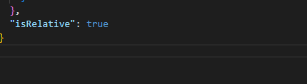

# Celerik Scaffolding

An extension to improve and speed up the creation of files in our projects.

## Install

Install via Extension Marketplace

## Usage

To create files with our extension is necessary:

- Install the extension
- Right click on a folder of the project
- Select one of the local or remote templates in the list
- Replace the variables found in the config.json file with the name you want to assign to it at the time of file creation
- Click on generate
- The files will be created following the path found inside the template, that is why each template must have the folder structure where you want them to be created, for example src/components

 

## Settings

### Local
 - You must store all your local templates in a folder called "scaffolding" at the root of your workspace.
 - Each template must have the config.json file with the list of all the variables to be replaced in the files.

### Remote
 - You must configure the URL from which you want to download your templates, by default you will find our **Celerik** URL from which you can access our public templates. To do this, click on the cogwheel in the upper right corner. The URL is the same as the one used to clone the project.
 - Each template should have the same structure as the local templates, with the config.json file indicating the variables to be replaced.

 ## ***Config.json*** file
In this file will be all the information of variables related to the template to create, in this file should be the variables to use, the expressions in case you want to use, and the indication if the creation of the template will be relative to the selected folder

 

#### ***Variables***
This is an array in which each element corresponds to a variable that will be searched in the defined templates and will be replaced by the value entered by the user. Variables can be a string that will be replaced or an object with the variable name and a help message that will be displayed to the user.

 

#### ***Expressions***
The expressions are the variables previously defined but with some convention applied, the expression is defined by assigning the name as a key and an object with the variable to be used and the convention to be applied, for example, camel, kebab...

 

The available options are: ***camel, kebab, lower, lowerWithSpace, pascal, snake upper, upperSnake, upperKebab, upperWithSpace***

 

#### ***isRelative***
This variable indicates whether templates will be created based on the selected folder. By default they will be created from the root

 
