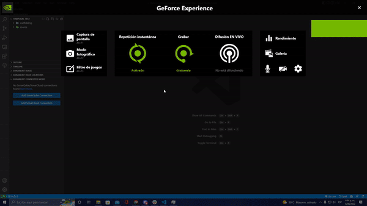

# Celerik Scaffolding

An extension to improve and speed up the creation of files in our projects.

## Install

Install via Extension Marketplace

## Usage

To create files with our extension is necessary:

- Install the extension
- Right click on a folder of the project (any, it does not affect the selected folder)
- Select one of the local or remote templates in the list
- Replace the variables found in the config.json file by the name we want to assign to it at the time of file creation
- Click on generate
- The files will be created following the path found inside the template, that is why it is important that each template has the folder structure where we want them to be created, for example src/components

 

## Settings

### Local
 - You must store all your local templates in a folder called "scaffolding" in the root of your workspace.
 - Each template must have the config.json file with the list of all the variables to be replaced in the files, the variables must be between two braces: **_{{var-example}}_**

 

### Remote
 - You must configure the url from which you want to download your templates, by default you will find our **Celerik** url from which you can access our public templates. The url is the same as the one used to clone the project
 - Each template should have the same structure as the local templates, with the config.json file indicating the variables to be replaced. The variables must be between two braces: **_{{var-example}}_**

 
